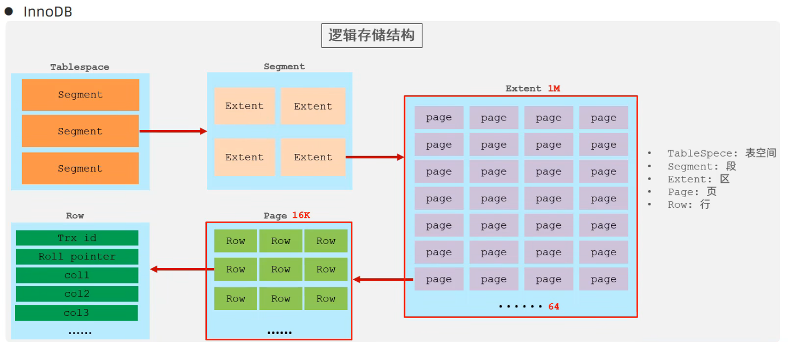
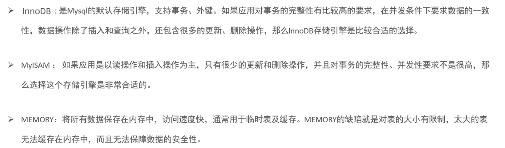

## MySQL体系结构
* 连接层
    * 最上层是一些客户端和链接服务，主要完成一些类似于连接处理、授权认证、以及相关的安全方案。服务器也会为安全接入的每个客户端验证它所具有的操作权限
* 服务层
    * 第二层架构主要完成大多数的核心服务功能，如SQL接口，并完成缓存的查询，SQL的分析和优化，部分内置函数的执行。所有跨存储引擎的功能也在这一层实现，如过程、函数
* 引擎层
    * 存储引擎真正负责了MySQL中数据的存储和提取，服务器通过API和存储引擎进行通信。不同的存储引擎具有不同的功能，这样我们可以根据自己的需要，来选取合适的存储引擎
* 存储层
    * 主要是将数据存储在文件系统之上，并完成与存储引擎的交互


## 存储引擎简介
* 存储引擎就是存储数据、建立索引、更新/查询数据等技术的实现方式。存储引擎是基于表的，而不是基于库的，所以存储引擎也可以被称为表类型


1. 在创建表时，指定存储引擎
```SQL
CREATE TABLE 表名(
    字段1 字段1类型 [COMMENT 字段1注释]
) ENGINE = INNODB [COMMENT 表注释];
```

2. 查看当前数据库支持的存储引擎
```SQL
SHOW ENGINES;
```


## 存储引擎特点

1. **InnoDB**
    * InnoDB是一种兼顾高可靠性和高性能的通用存储引擎，在MySQL5.5之后，InnoDB是默认的MySQL存储引擎
  
    * 特点
        * DML操作遵循ACID模型，支持**事务**
        * **行级锁**，提高并行访问性能
        * 支持**外键FOREIGN KEY** 约束，保证数据的完整性和正确性
    
    * 文件
        * xxx.ibd: xxx代表的是表名，innoDB引擎的每张表都会对应这样一个表空间文件，存储该表的表结构(frm,sdi)、数据和索引
        * 参数: innodb_file_per_table 如果打开表示每一张表都对应一个表空间文件


    * 逻辑存储结构
         


2. **MyISAM**
    * MyISAM是MySQL早期的默认存储引擎

    * 特点
        * 不支持事务，不支持外键
        * 支持表锁，不支持行锁
        * 访问速度快

    * 文件
        * xxx.sdi :存储表结构信息
        * xxx.MYD :存储数据
        * xxx.MYI :存储索引

3. Memory
    * Memory引擎的表数据是存储在内存中的，由于受到硬件问题、或断电问题的影响，只能将这些表作为临时表或缓存使用

    * 特点
        * 内存存放
        * hash索引(默认)
    * 文件
        * xxx.sdi :存储表结构信息


|特点|InnoDB|MyISAM|Memory|
|---|------|-------|------|
|存储限制|64TB|有|有|
|事务安全|支持|-|-|
|锁机制|行锁|表锁|表锁|
|B+tree索引|支持|支持|支持|
|Hash索引|-|-|支持|
|全文索引|支持(5.6版本之后)|支持|-|
|空间使用|高|低|N/A|
|内存使用|高|低|中等|
|批量插入速度|低|高|高|
|支持外键|支持|-|-|


## 存储引擎选择
* 根据应用系统的特点选择合适的存储引擎。对于复杂的应用系统，还可以根据实际情况多种存储引擎进行组合

 


