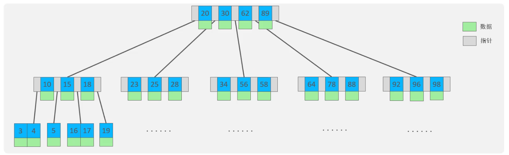
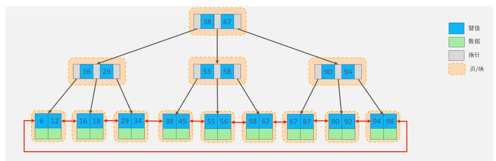

## 索引概述
* 介绍
  * 索引(index)是帮助MySQL高效获取数据的数据结构(有序)，在数据之外，数据库系统还维护着满足特定查找算法的数据结构，这些数据结构以某种方式引用(指向)数据，这样就可以在这些数据结构上实现高级查找算法，这种数据结构就是索引
  
  * 优缺点
  * |优势|劣势|
    |----|---|
    提高数据检索效率，降低数据库的IO成本|索引列也是要占空间的|
    |通过索引列对数据进行排序，降低数据排序的成本，降低CPU的消耗|索引大大提高了查询效率，同时却降低了更新表的速度，如对表进行INSERT、UPDATE、DELETE时，效率降低|

## 索引结构
* MySQL的索引是在存储引擎层实现的，不同的存储引擎有不同的结构，主要包含以下几种:

|索引结构|描述|
|-------|----|
|B+Tree索引|最常见的索引类型，大部分引擎都支持B+数索引|
|Hash索引|底层数据结构是用哈希表实现的，只有精确匹配索引列的查询才有效，不支持范围查询|
|R-tree(空间索引)|空间索引是MyISAM引擎的一个特殊索引类型，主要用于地理空间数据类型，通常使用较少|
|Full-text(全文索引)|是一种通过建立倒排索引，快速匹配文档的方式，类似于Lucene,Solr,ES|

|索引|InnoDB|MyISAM|Memory|
|---|------|-------|------|
|B+tree索引|支持|支持|支持|
|Hash索引|不支持|不支持|支持|
|R-tree索引|不支持|支持|不支持|
|Full-text|5.6版本后支持|支持|不支持|

## B-Tree

* B-Tree(多路平衡查找树)
* 以一颗最大度数(max-degree) 为5的b-tree为例(每个节点最多存储4个key,5个指针)

* 树的度数指的是一个节点的子节点个数

* **B+树**
* 与B-Tree区别:
  * B+树的所有元素会出现在叶子节点，形成一个单向链表，非叶子节点起到索引数据的作用
* MySQL索引数据结构对经典的B+Tree进行了优化，在原B+Tree的基础上，增加一个指向相邻叶子节点的链表指针，就形成了带有顺序指针的B+Tree，提高区间访问的性能

###
* 在图形化页面理解B树和B+树
* https://www.cs.usfca.edu/~galles/visualization/

## Hash

* 哈希索引就是采用一定的hash算法，将键值换算成新的hash值，映射到对应的槽位上，然后存储在hash表中
* 如果两个(或者多个)键值，映射到一个相同的槽位上，他们就产生了hash冲突(也称为hash碰撞)，可以通过链表解决

* Hash索引特点
    1. Hash索引只能用于对等比较(=, in)，不支持范围查询(between, >, <, ...)
    2. 无法利用索引完成排序操作
    3. 查询效率高，通常只需要一次检索就可以了，效率通常要高于B+tree索引

* 在MySQL中，支持hash索引的是Memory引擎，而InnoDB中具有自适应hash功能，hash索引是存储引擎根据B+Tree索引在指定条件下自动构建的

##### 为什么InnoDB存储引擎选择使用B+tree索引结构
* 相对于二叉树，层级更少，搜索效率高
* 对于B-tree，无论是叶子节点还是非叶子节点，都会保存数据，这样导致一页中存储的键值减少，指针跟着减少，要同样保存大量数据，只能增加树的高度，导致性能降低
* 相对hash索引，B+tree支持范围匹配和排序操作